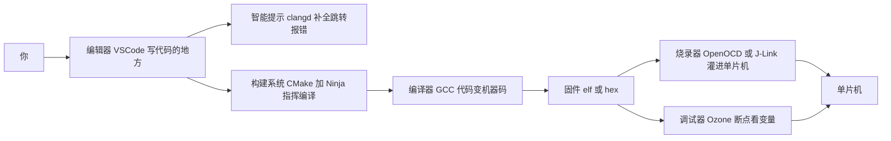
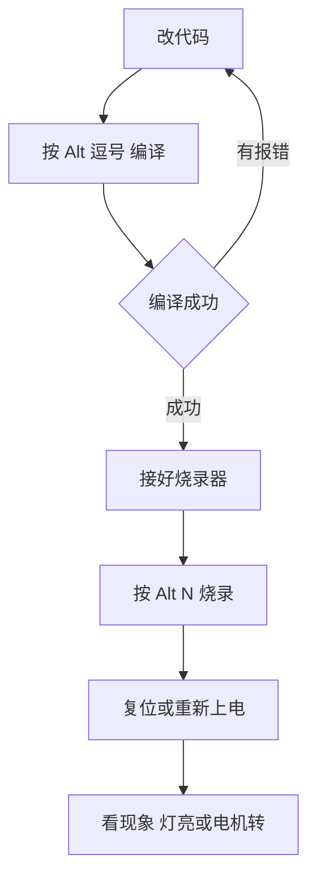
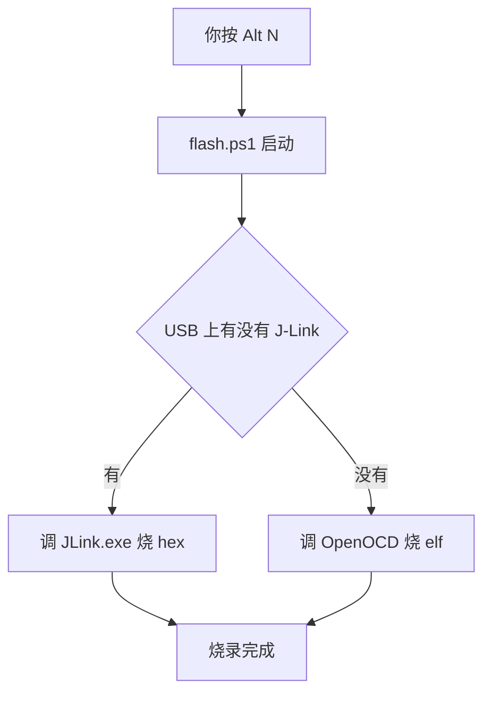

# 修复保姆级图解文档（内容丢失 + Mermaid 渲染失败）

## TL;DR (For humans)

`D:\Newcode\RM战队嵌入式开发环境圣经-保姆级图解.md` 出了两个问题，都要修：
1. **内容丢失**：文档从 1227 行变成 1134 行，**第0章《读前必读》整章 + 第1章 1.1 节 + 开头引言的一部分全没了**。第1章现在直接从"1.2 各角色关系图"开始。
2. **Mermaid 流程图全部渲染失败**：Typora 报 `Parse error on line 1: flowchart LR You ... got 'ALPHA'`。原因是 5 个流程图用了 Typora 内置 Mermaid 吃不下的语法：节点文字里的 **emoji**、**`<br/>` 换行**、**中文箭头标签**、**`style ... fill:#...` 上色行**、**`(("..."))` / `(["..."])` 特殊节点**。

## 修复目标（用户明确：只改流程图，不补回丢失文字）
- **不补回**丢失的第0章/1.1节/引言。用户明确表示不修复丢失的文字。
- **只**改写现存的 4 个 Mermaid 图为 Typora 兼容的极简语法（去 emoji、去 `<br/>`、箭头标签用简短中文或去掉、去 `style` 行、节点统一用 `["文字"]` 或 `{"判断"}`）。当前文档只剩 4 个 Mermaid（1.2关系图、第8章、第9章、第12章；原第0章路线图那个已随丢失内容一起没了）。

## Mermaid 兼容写法规则（所有图统一）
- 节点 ID 用字母，节点文字用 `["纯文字"]`，判断用 `{"文字"}`。
- **不要 emoji、不要 `<br/>`**（多行改成一行短语，或用中文顿号分隔）。
- 箭头 `-->`；带标签用 `-->|是|` 这种简短标签，避免长中文+标点。
- **删掉所有 `style` 行**。
- 首行 `flowchart TD` 或 `flowchart LR` 后**必须换行**再写节点。

## Todos

### 1. [x] 只改写 1.2 关系图的 Mermaid（不补回任何丢失文字）
**WHERE**: 第16-36行那个 ```mermaid flowchart LR（含 emoji、`<br/>`、`style`、`(("..."))` 等坏语法）。
**HOW**: 只替换这一个 Mermaid 代码块（从 ```mermaid 到结束的 ```），前后文字一律不动，不补第0章、不补1.1。替换为 Typora 兼容写法：

**EXPECT**: 1.2 的流程图能在 Typora 渲染出来，其余文字原样不动。
**QA**: 读回该 Mermaid 块，确认无 emoji/`<br/>`/style/双括号节点。

### 2. [x] 改写第8章编译流程图（约575行）为兼容写法
**WHERE**: 第8章那个 ```mermaid flowchart TD（含 `{编译成功?}`、`<br/>`）。
**HOW**: 替换为：

**QA**: 读回确认无 `<br/>`、无 emoji。

### 3. [x] 改写第9章烧录判断流程图（约671行）为兼容写法
**WHERE**: 第9章 ```mermaid flowchart TD（含 `<br/>`、`✅`）。
**HOW**: 替换为：

**QA**: 读回确认。

### 4. [x] 改写第12章 Ozone 流程图（约927行）为兼容写法
**WHERE**: 第12章 ```mermaid flowchart LR（含 `<br/>`）。
**HOW**: 替换为：

**QA**: 读回确认。

### 5. [x] 全文校验
读回全文：确认第0-13章+附录齐全（14章）、5个 Mermaid 全是兼容写法（无 emoji/`<br/>`/style/特殊节点）、代码围栏成对、行数恢复合理（应回到约 1200+ 行）。

## Must-NOT-Have
- 不改动其它正常章节的正文文字。
- 改写流程图时不得丢失原图表达的逻辑（节点和箭头关系要一致）。
- 不改其它文件。
- 兼容写法里禁止出现 emoji、`<br/>`、`style` 行、`(("..."))`/`(["..."])`。
